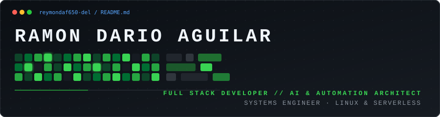
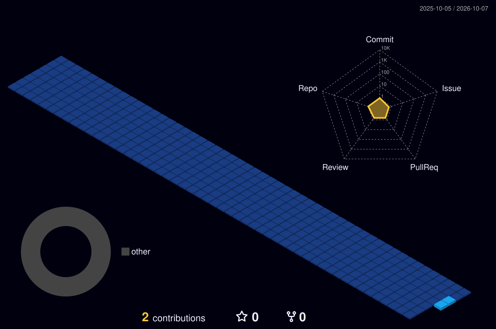

<div align="center">

  <!-- Header Banner -->
  

  <br/><br/>

  <!-- Tagline Dinámico / Typewriter -->
  <a href="https://github.com/reymondaf650-del">
    
  </a>

  <br/><br/>

  <!-- Redes y Contacto -->
  <table>
    <tr>
      <td align="center" width="130">
        <a href="https://www.linkedin.com/in/ramon-dario-aguilar-flores-128298418" target="_blank">
          <br>
          <sub><b>LinkedIn</b></sub>
        </a>
      </td>
      <td align="center" width="130">
        <a href="https://github.com/reymondaf650-del" target="_blank">
          <br>
          <sub><b>GitHub</b></sub>
        </a>
      </td>
      <td align="center" width="130">
        <a href="mailto:darioaguilar650@gmail.com" target="_blank">
          <br>
          <sub><b>Gmail</b></sub>
        </a>
      </td>
      <td align="center" width="130">
        <a href="https://wa.me/59165011615" target="_blank">
          <br>
          <sub><b>WhatsApp</b></sub>
        </a>
      </td>
    </tr>
  </table>

</div>

---

### ░░ WHO I AM ░░

> Egresado de **Ingeniería en Sistemas** (UDABOL, Santa Cruz - Bolivia) especializado en **desarrollo web Full Stack y arquitectura de software**. Cuento con experiencia sólida en el diseño e implementación de sistemas ERP empresariales, optimización de flujos de trabajo mediante APIs y administración de servidores en entornos Linux y arquitecturas serverless escalables.

```yaml
Name: Ramon Dario Aguilar Flores
Location: Santa Cruz de la Sierra, Bolivia
Degree: B.S. Systems Engineering (UDABOL)
Core: Full Stack Development · AI Integrations · Cloud Architecture
Status: Open to high-impact projects & innovative tech roles
```

---

### ░░ WHAT I DO ░░

* **Arquitectura Full Stack & ERPs**: Desarrollo integral (frontend y backend) de sistemas empresariales centralizados (ventas, compras, producción, almacenes) con **React, Next.js, FastAPI, Node.js y PostgreSQL**.
* **Plataformas en Tiempo Real**: Soluciones de streaming y videollamadas con **WebRTC + Socket.io**, integrando microservicios de triaje clínico remoto con estimación de signos vitales (**rPPG / MediaPipe**) y traducción multimodal.
* **Pipelines Multi-IA & Automatización**: Arquitecturas con conmutación por error (fallback) entre **Groq (LPU), DeepSeek, Google Gemini y OpenAI**, estructurando ingestas inteligentes, análisis de reputación y resúmenes ejecutivos en JSON.
* **Web Scraping & Extensiones Distribuidas**: Extracción de datos en tiempo real mediante **Extensiones de Chrome (Manifest V3)**, **Crawlee** y **Apify**, orquestando colas de tareas serverless en **Vercel** y almacenamiento en CDN (**EasyPanel**).
* **Infraestructura & Servidores**: Administración de VPS en **Linux**, contenerización con **Docker**, automatizaciones con **Google Apps Script / APIs de Microsoft (OneDrive, Outlook)** y control de acceso con **ZKTeco**.

---

### ░░ VISION ░░

> Impulsar la transformación digital construyendo software pragmático, de alto rendimiento y enfocado en resolver problemas reales. Aspiro a ser parte de la generación de ingenieros que fusiona arquitecturas web robustas con Inteligencia Artificial aplicada para maximizar la productividad y eliminar fricciones operativas.

---

### ░░ BEYOND CODE ░░

* 🐧 **Linux Enthusiast**: Automatización y administración remota de entornos y dispositivos móviles.
* 🤖 **Exploración de Modelos de IA**: Pruebas continuas de nuevos LLMs, visión artificial y agentes autónomos.
* 🔌 **Hardware & Domótica**: Integraciones con dispositivos biométricos y hardware de red.

---

<div align="center">

### ░░ 3D CONTRIBUTION TIMELINE ░░

<!-- Generado automáticamente por GitHub Actions vía github-profile-3d-contrib -->


</div>

---

<div align="center">

### ░░ TECH STACK & TOOLS ░░

#### Lenguajes de Programación
<p align="center">
  
</p>

#### Frontend & UI
<p align="center">
  
</p>

#### Backend, Real-Time & APIs
<p align="center">
  
</p>

#### Inteligencia Artificial & Automatización
<p align="center">
  
  
  
  
  
  
</p>

#### Bases de Datos, DevOps & Cloud
<p align="center">
  
</p>

</div>

---

<div align="center">
  <sub>Diseñado con precisión para <a href="https://github.com/reymondaf650-del">reymondaf650-del</a> · Santa Cruz, Bolivia 🇧🇴</sub>
</div>
